# Discomap Gallery (beta)
Here below is a list of the main web mapping applications created by the EEA and hosted in discomap.

| 
[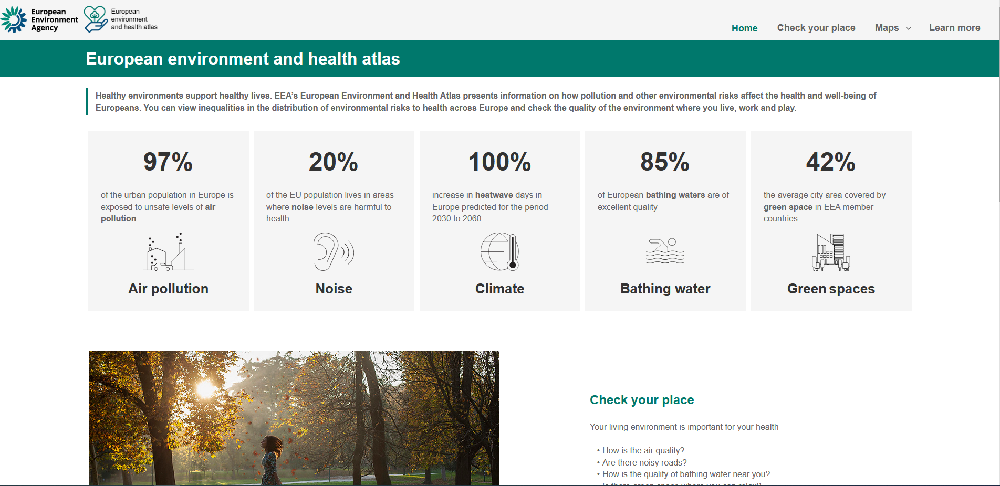{: style="height:100px;display: block; margin-left: auto; margin-right: auto;"}](https://discomap.eea.europa.eu/atlas/){:target="_blank"}
  | [European environment and health atlas](https://discomap.eea.europa.eu/atlas/){:target="_blank" style="font-weight: normal; font-size: 15px;"}  The atlas provides user-friendly data and information on how pollution and other environmental risks impact the health and well-being of Europeans. It also demonstrates how environmental assets offer protection. {:style="font-weight: normal; color: #404040; font-size: 13px;vertical-align:top;"} | 
| - | - |
| 
 [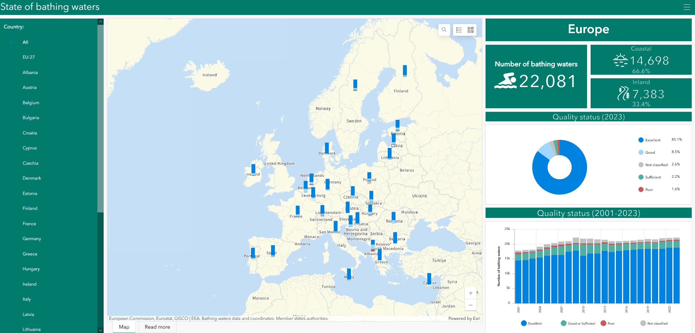{: style="height:100px;display: block; margin-left: auto; margin-right: auto;"}](https://discomap.eea.europa.eu/bathingwater/){:target="_blank"}
  | [State of European bathing waters](https://discomap.eea.europa.eu/bathingwater/){:target="_blank" style="font-weight: normal; font-size: 15px;"}  This application displays bathing water locations and their quality for both the latest and previous seasons. Symbols are color-coded to reflect the quality status achieved in the most recent period. Data is presented at two levels: country (less detailed) and individual bathing water sites (more detailed). {:style="font-weight: normal; font-size: 13px;vertical-align:top;"} |
| 
[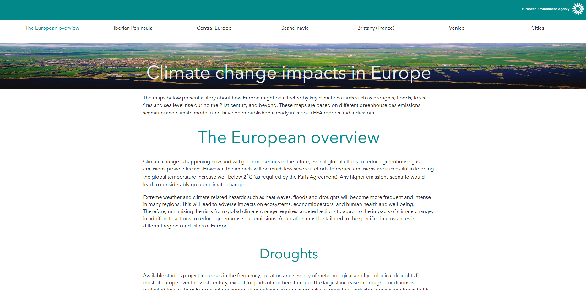{: style="height:100px;display: block; margin-left: auto; margin-right: auto;"}](https://discomap.eea.europa.eu/climate/){:target="_blank"}
  | [Climate change impacts in Europe](https://discomap.eea.europa.eu/climate/){:target="_blank" style="font-weight: normal; font-size: 15px;"}  This narrative explores how Europe may be impacted by key climate hazards such as droughts, floods, forest fires, and sea level rise throughout the 21st century and beyond. These maps, derived from various greenhouse gas emissions scenarios and climate models, have been published in several EEA reports and indicators. {:style="font-weight: normal; font-size: 13px;vertical-align:top;"} |
| 
[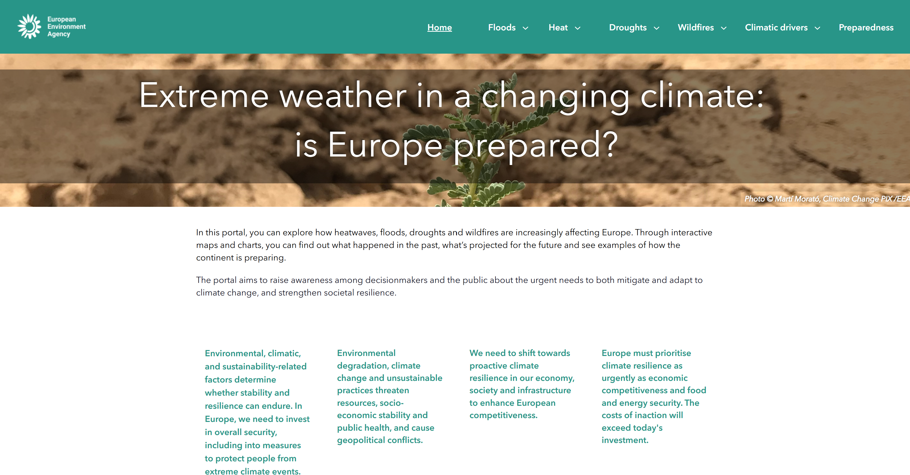{: style="height:100px;display: block; margin-left: auto; margin-right: auto;"}](https://discomap.eea.europa.eu/ClimatePreparedness2025/){:target="_blank"}
  | [Extreme weather in a changing climate: is Europe prepared?](https://discomap.eea.europa.eu/ClimatePreparedness2025/){:target="_blank" style="font-weight: normal; font-size: 15px;"}  The Climate Preparedness portal aims to raise awareness among decisionmakers and the public about the urgent needs to both mitigate and adapt to climate change, and strengthen societal resilience. {:style="font-weight: normal; font-size: 13px;vertical-align:top;"} |
| 
[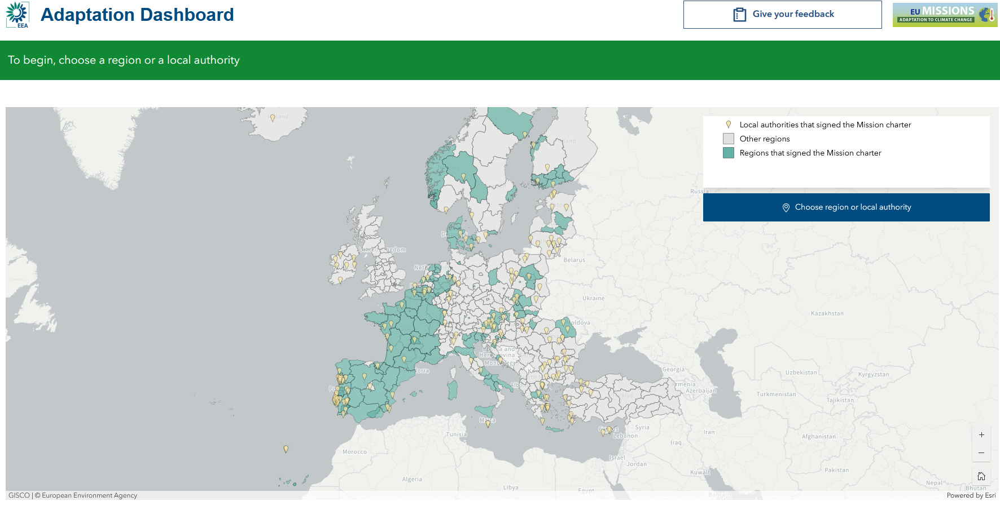{: style="height:100px;display: block; margin-left: auto; margin-right: auto;"}](https://discomap.eea.europa.eu/adaptation-dashboard/){:target="_blank"}
  | [Adaptation Dashboard](https://discomap.eea.europa.eu/adaptation-dashboard/){:target="_blank" style="font-weight: normal; font-size: 15px;"}  Aims to inform regions on climate risk and impacts as well as adaptation policies and measures. {:style="font-weight: normal; font-size: 13px;vertical-align:top;"} |
| 
[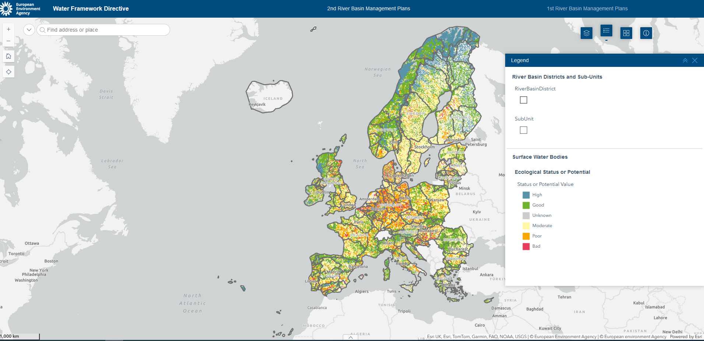{: style="height:100px;display: block; margin-left: auto; margin-right: auto;"}](https://discomap.eea.europa.eu/WaterFrameworkDirective/){:target="_blank"}
  | [Water Framework Directive](https://discomap.eea.europa.eu/WaterFrameworkDirective/){:target="_blank" style="font-weight: normal; font-size: 15px;"}  Contains information from the River Basin Management Plans (RBMPs) reported by EU Members States according to article 13 of the Water Framework Directive (WFD). {:style="font-weight: normal; font-size: 13px;vertical-align:top;"} |
| 
[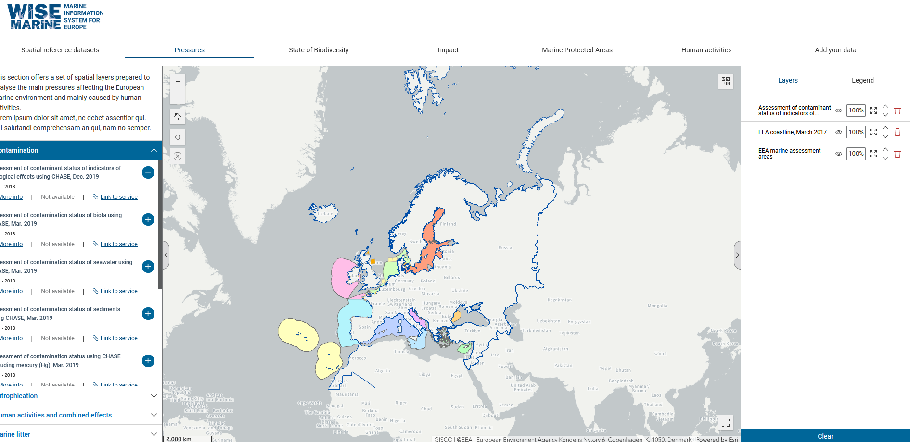{: style="height:100px;display: block; margin-left: auto; margin-right: auto;"}](https://discomap.eea.europa.eu/wise-marineviewer/){:target="_blank"}
  | [WISE Marine](https://discomap.eea.europa.eu/wise-marineviewer/){:target="_blank" style="font-weight: normal; font-size: 15px;"}  A tool designed for the swift exploration and visualisation of marine spatial datasets for Europe's Seas. {:style="font-weight: normal; font-size: 13px;vertical-align:top;"} |
| 
[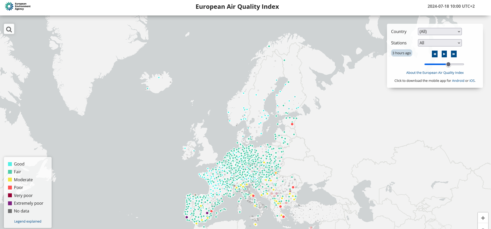{: style="height:100px;display: block; margin-left: auto; margin-right: auto;"}](https://airindex.eea.europa.eu/AQI/index.html){:target="_blank"}
  | [Air Quality Index](https://airindex.eea.europa.eu/AQI/index.html){:target="_blank" style="font-weight: normal; font-size: 15px;"}  Allows users to understand more about air quality where they live, work or travel. Displaying up-to-date information for Europe, users can gain insights into the air quality in individual countries, regions and cities. {:style="font-weight: normal; font-size: 13px;vertical-align:top;"} |
| 
[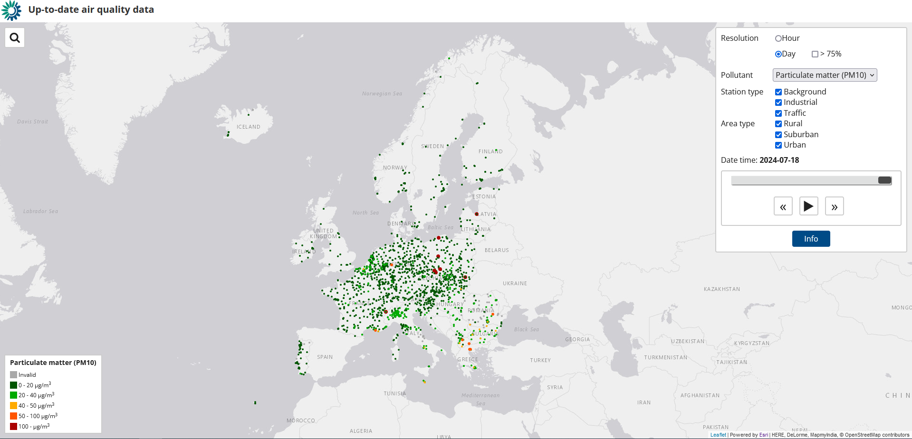{: style="height:100px;display: block; margin-left: auto; margin-right: auto;"}](https://discomap.eea.europa.eu/Map/UTDViewer/UTDViewer/){:target="_blank"}
  | [Up-to-date air quality data](https://discomap.eea.europa.eu/Map/UTDViewer/UTDViewer/){:target="_blank" style="font-weight: normal; font-size: 15px;"}  Shows up-to-date (UTD) air quality data for the last ten days. Data are provided by the EEA’s Member and Cooperating countries and other voluntary reporting countries. {:style="font-weight: normal; font-size: 13px;vertical-align:top;"} |
| 
[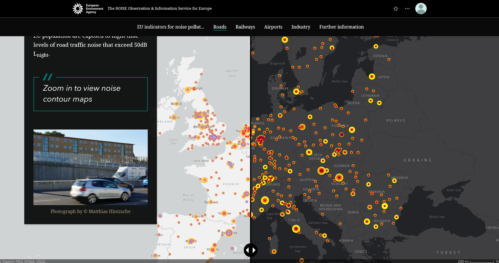{: style="height:100px;display: block; margin-left: auto; margin-right: auto;"}](https://noise.eea.europa.eu){:target="_blank"}
  | [Noise story map](https://noise.eea.europa.eu){:target="_blank" style="font-weight: normal; font-size: 15px;"}  Explore NOISE maps to see environmental noise from roads, railways, airports, industry and in cities where you live. {:style="font-weight: normal; font-size: 13px;vertical-align:top;"} |
| 
[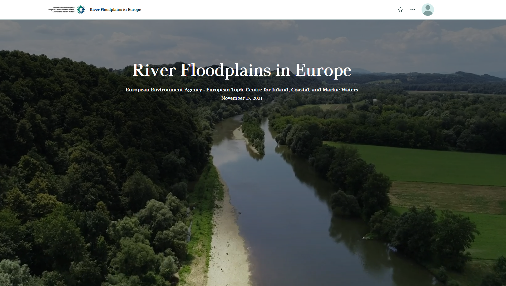{: style="height:100px;display: block; margin-left: auto; margin-right: auto;"}](https://portal.discomap.eea.europa.eu/arcgis/apps/storymaps/stories/497dcd2cd7da49f5bacc791d9b49e162){:target="_blank"}
  | [River Floodplains in Europe](https://portal.discomap.eea.europa.eu/arcgis/apps/storymaps/stories/497dcd2cd7da49f5bacc791d9b49e162){:target="_blank" style="font-weight: normal; font-size: 15px;"}   This story map explains the importance of floodplains, their types, and condition and gives examples of restoration, as the context for the target of the 2030 Biodiversity Strategy. {:style="font-weight: normal; font-size: 13px;vertical-align:top;"} |
| 
[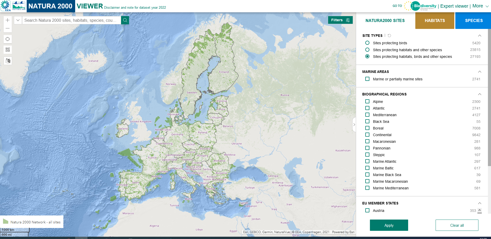{: style="height:100px;display: block; margin-left: auto; margin-right: auto;"}](https://natura2000.eea.europa.eu/){:target="_blank"}
  | [Natura2000](https://natura2000.eea.europa.eu/){:target="_blank" style="font-weight: normal; font-size: 15px;"}  Enables the user to locate and explore Natura 2000 sites anywhere in the EU at the press of a button. {:style="font-weight: normal; font-size: 13px;vertical-align:top;"} |
| 
[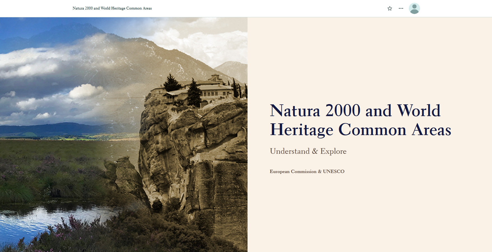{: style="height:100px;display: block; margin-left: auto; margin-right: auto;"}](https://portal.discomap.eea.europa.eu/arcgis/apps/storymaps/collections/4a0cf90d898c4f1696aafa3b8414c392){:target="_blank"}
  | [Explore Natura2000](https://portal.discomap.eea.europa.eu/arcgis/apps/storymaps/collections/4a0cf90d898c4f1696aafa3b8414c392){:target="_blank" style="font-weight: normal; font-size: 15px;"} {:style="font-weight: normal; font-size: 13px;vertical-align:top;"} |
| 
[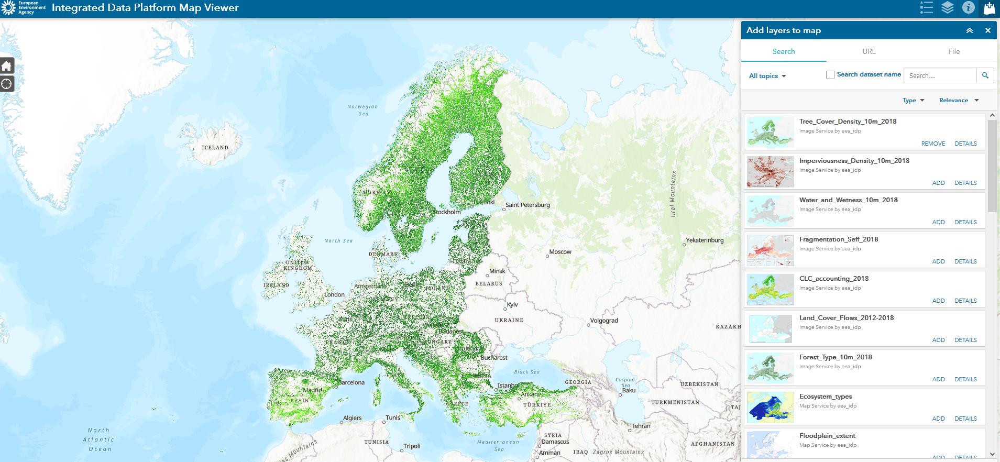{: style="height:100px;display: block; margin-left: auto; margin-right: auto;"}](https://discomap.eea.europa.eu/discoapp/IDP/){:target="_blank"}
  | [Integrated Data Platform](https://discomap.eea.europa.eu/discoapp/IDP/){:target="_blank" style="font-weight: normal; font-size: 15px;"}  Visualizes spatial datasets through web map services, focusing on those frequently used in assessments. The web map viewer allows for spatial overlays, enabling interactive exploration of the datasets. This exploration enhances understanding of their potential in environmental assessments. {:style="font-weight: normal; font-size: 13px;vertical-align:top;"} |
