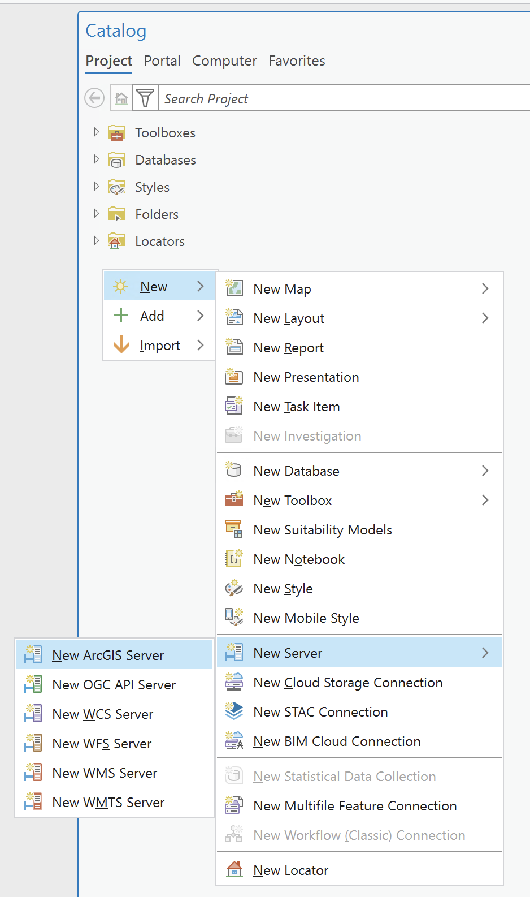
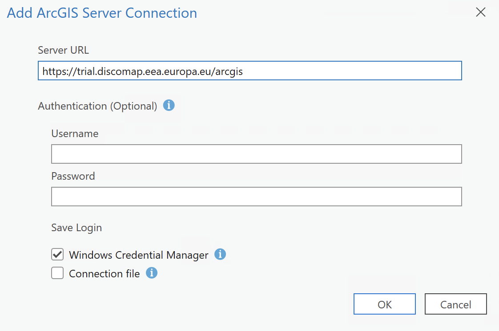
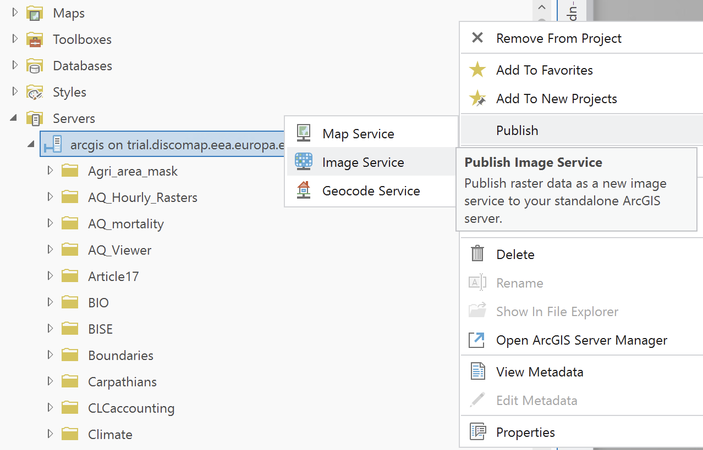
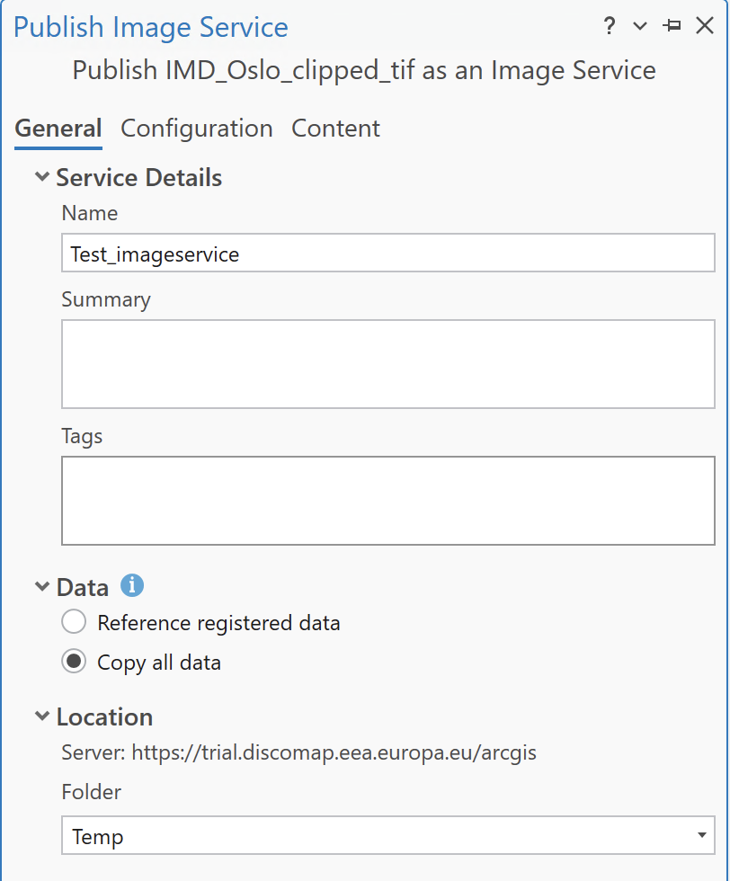
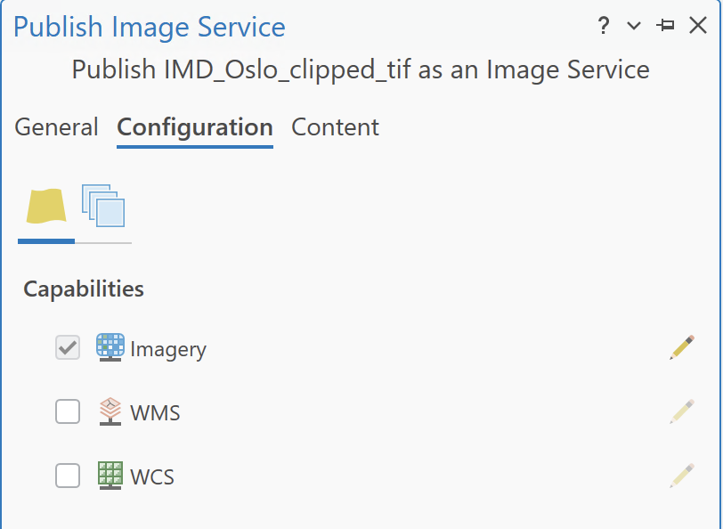
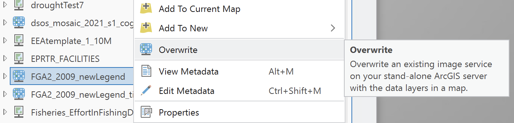

# Image Service Publishing from ArcGIS Pro to ArcGIS Server Standalone

This guide walks you through the steps to publish an image service from ArcGIS Pro to an ArcGIS Server standalone. Follow each step to successfully share your raster data as a web service.

## Introduction

### Objective
Learn how to publish an image service from ArcGIS Pro to a standalone ArcGIS Server.

### Prerequisites
- ArcGIS Pro installed and licensed.
- Access to an ArcGIS Server standalone.
- Proper permissions to publish services on the server.
- A raster dataset (e.g., .tiff) ready to publish.

---

## Connect ArcGIS Pro to the Server

### Create Connection
1. Open ArcGIS Pro.
2. Go to the `Catalog` pane.
3. Right-click on `Servers` and select `Add ArcGIS Server`.
{: style="height:300px;display: block; margin-left: auto; margin-right: auto; margin-top:20px; margin_bottom:20px"}

4. Provide the server's URL and your EIONET credentials. You can check the full list of available servers in the **EEA Publishing Guidelines** document.
{: style="height:300px;display: block; margin-left: auto; margin-right: auto; margin-top:20px; margin_bottom:20px"}

---

## Initialize the Sharing Process

### Select Server Connection
Publishing to a standalone server requires selecting the specific server connection first.

1. Open your ArcGIS Pro project and go to the `Catalog` pane.
2. Look for your ArcGIS Server connection and Right-click on it.
3. Select `Publish` > `Image Service` (or select your .tiff file/raster layer depending on context).
   *(Note: Ensure you are right-clicking the server connection to publish options, or right-clicking the layer and selecting Share as Web Layer, selecting the server).*
{: style="height:300px;display: block; margin-left: auto; margin-right: auto; margin-top:20px; margin_bottom:20px"}

---

## Set Item Properties

### General Settings
A new window will appear titled **Publish Image Service**.

- **Connection**: Select your ArcGIS Server connection from the dropdown.
- **Image Service Name**: Give your service a clear, concise name (avoid spaces or special characters).
- **Server Folder**: Choose an existing folder on your server or create a new one to keep your services organized.

---

## Configure Service & Capabilities

### General Tab
**Name & Location**: Enter a name for your service and select the folder on the server. Fill the Summary and Tags with the corresponding metadata.

**Data Reference**: 
- In the `Content` section, check the **Data Source**.
- If it says **Registered**, the source folder of the image must be registered with the server.
- If it says **Upload**, the server will copy the entire raster to its own directories.
  > **Note**: Uploading can be very slow for large datasets, so make your choice wisely.
{: style="height:300px;display: block; margin-left: auto; margin-right: auto; margin-top:20px; margin_bottom:20px"}

### Configuration Tab
This is where you define how users can interact with your imagery. Click on the `Configuration` tab in the publishing window.

- Enable specific capabilities as needed (e.g., WMS, WCS).
{: style="height:300px;display: block; margin-left: auto; margin-right: auto; margin-top:20px; margin_bottom:20px"}

---

## Analyze and Publish

### Analyze
1. Click the `Analyze` button at the bottom of the pane. This checks for common issues like missing metadata or unsupported coordinate systems.
2. **Fix Errors**: If you see a red "X," you must resolve it before publishing. Yellow "!" warnings are suggestions but won't stop the process.

### Publish
1. Click `Publish`.
2. Once the process finishes, you will see a success message. Your image service is now live.

---

## Overwrite an Existing Service

### Locate and Overwrite
If you need to republish or update an existing service:

1. Locate the service in the `Servers` section of the `Catalog`.
2. Right-click on the service and choose `Overwrite`.
3. Follow the prompts to update the service with new data or settings.
{: style="height:150px;display: block; margin-left: auto; margin-right: auto; margin-top:20px; margin_bottom:20px"}

---

## Test the Published Service

### Access the Service
1. Open a web browser and go to the service's URL.
2. Ensure the map or data layers are accessible and display correctly.

### Test Functionalities
If you enabled additional capabilities (e.g., `WMS`), test their functionalities.

---

## Conclusion & Best Practices

### Maintenance
Regularly monitor and maintain your service to ensure data is up-to-date and performance is optimal.

### Best Practices
- **Optimize data** before publishing for efficient service performance.
- **Use logical server folders** to organize and manage services effectively.
