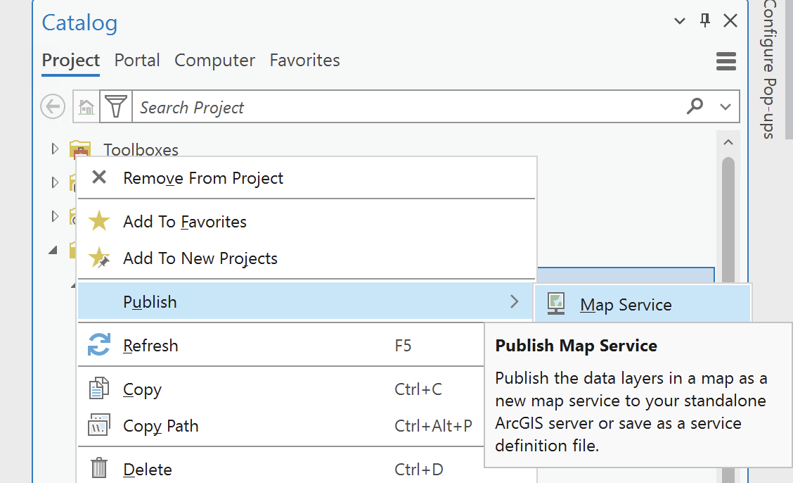
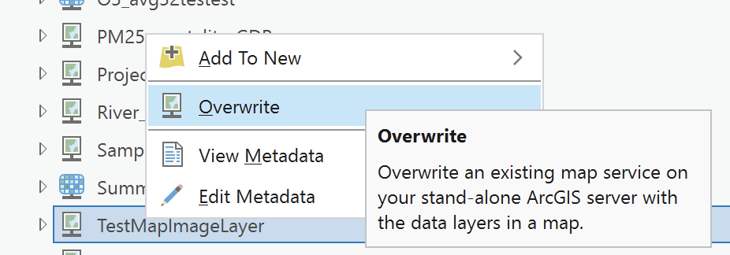

# Publishing Services from ArcGIS Pro to ArcGIS Server Standalone

This guide walks you through the steps to publish a map service from ArcGIS Pro to an ArcGIS Server standalone. Follow each step to successfully share your GIS data as a web service.

## Introduction

### Objective
Learn how to publish a map service from ArcGIS Pro to an ArcGIS Server standalone.

### Prerequisites
- ArcGIS Pro installed and licensed.
- Access to an ArcGIS Server standalone.
- Proper permissions to publish services on the server.

---

## Connect ArcGIS Pro to the Server

### Connect ArcGIS Pro to ArcGIS Server
1. Open ArcGIS Pro.
2. Go to the `Catalog` pane.
3. Right-click on `Servers` and select `Add ArcGIS Server`.
{: style="height:600px;display: block; margin-left: auto; margin-right: auto; margin-top:20px; margin_bottom:20px"}
4. Provide the server's URL and credentials. You can check the full list of available servers in the **[EEA Publishing guidelines](https://discomap.eea.europa.eu/doc/EEA_PublishingGuidelines.pdf)** document.
{: style="height:300px;display: block; margin-left: auto; margin-right: auto; margin-top:20px; margin_bottom:20px"}

### Verify the Connection
Ensure that the server connection appears in the `Servers` section of the catalog.

---

## Prepare Data in ArcGIS Pro

### Open Project and Add Data
1. Open an existing project or create a new one in ArcGIS Pro.
2. Add the layers (e.g., shapefiles, feature classes) you wish to publish to your map.

### Configure Layer Properties
Review layer properties, such as symbology and projection, which will impact how the service is visualized.

---

## Publish a New Service

### Locate the Server and Publish the Service
1. In the `Catalog` pane, go to the `Servers` section to view the list of available servers.
2. Right-click on the server where you want to publish the service and select `Publish`.
3. Select the type of service you want to publish depending on your needs and your data.
{: style="height:300px;display: block; margin-left: auto; margin-right: auto; margin-top:20px; margin_bottom:20px"}

### Select the Map to Publish
- A new window will open, listing all available maps in your ArcGIS Pro project.
- Select the map you wish to publish as a service.

### Configure Service Details & Capabilities
- **Name & Folder**: Enter a name for your service and select the folder on the server.
- **Capabilities**: Select capabilities (e.g., `WMS`, `Feature Access`) required for your service.

---

## Overwrite an Existing Service

### Locate and Overwrite the Service
1. If you need to republish or update an existing service, locate the service in the `Servers` section of the `Catalog`.
2. Right-click on the service and choose `Overwrite`.
3. Follow the prompts to update the service with new data or settings.
{: style="height:150px;display: block; margin-left: auto; margin-right: auto; margin-top:20px; margin_bottom:20px"}
---

## Analyze and Optimize

### Analyze Before Publishing
- Click `Analyze` to check for any warnings or errors before publishing.
- Address any reported issues (e.g., missing data, incorrect projections).

### Optimize for Performance
Consider optimizing data and symbology to enhance service performance.

---

## Publish the Service

### Publish the Web Layer
- After addressing analysis issues, click `Publish`.
- Wait for the publishing process to complete, which may take some time depending on data size.

### Confirm Successful Publishing
Once published, ArcGIS Pro will display a confirmation message with a link to the service.

---

## Test the Published Service

### Access the Published Service
- Open a web browser and go to the service's URL.
- Ensure the map or data layers are accessible and display correctly.

### Test Service Functionalities
If you enabled additional capabilities (e.g., `WMS`), test their functionalities.

---

## Conclusion & Best Practices

### Service Maintenance
Regularly monitor and maintain your service to ensure data is up-to-date and performance is optimal.

### Best Practices
- Optimize data before publishing for efficient service performance.
- Use logical server folders to organize and manage services effectively.