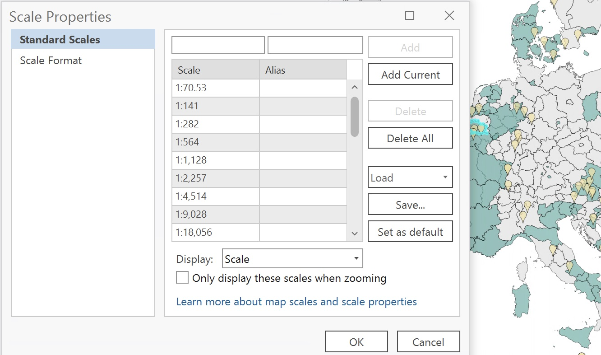
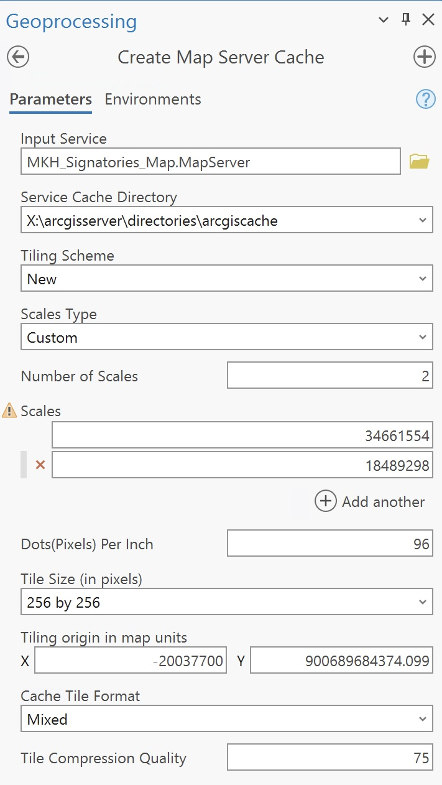
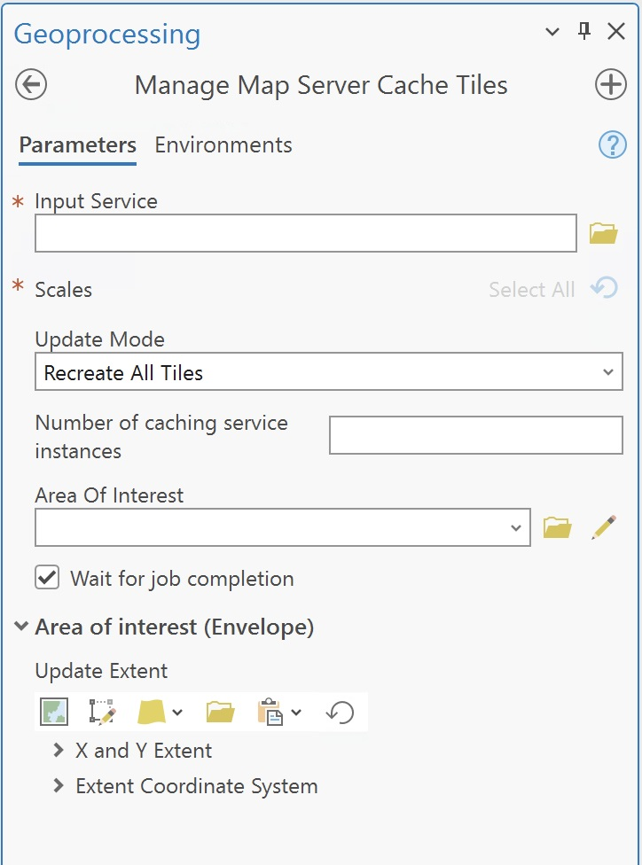

# Publishing a Tile Cache Service
This documentation explains how to publish a tile cache service using **ArcGIS Pro**. Follow these steps to prepare, cache, and publish your data. 

## What is a Tile Cache Service
Tile cache a type of web map service that delivers map data as pre-rendered image tiles. These tiles are small, fixed-size images (usually 256x256 pixels) that are stitched together by a client application, like a web browser or GIS software, to create a seamless, zoomable map.

## Tile cache vs regular (dynamic) map services
Tile Service: Pre-rendered images served as tiles; faster performance but less flexible for custom styling or querying.
Dynamic Map Service: Renders maps on-the-fly based on user requests; slower but allows for dynamic styling and querying of data.

## Prepare Your Data

1. Open **ArcGIS Pro**.
2. Add the desired data layers to a new map.
3. Symbolize the layers as needed.
4. Set the coordinate system for the map to ensure proper alignment with the basemap or intended usage.

## Publish service

1. In the `Catalog` pane, go to the `Servers` section to view the list of available servers. Add a server if needed (follow steps from the publishing tutorial).
2. Right-click on the server where you want to publish the service and select `Publish`.
3. Select the type of service you want to publish depending on your needs and your data.
4. In the **Publish Layer** pane, under **Configuration**:
   - Verify the **Tiling Scheme** matches your intended use.
   - Ensure the **Tile Cache** path is correctly set.
6. Click **Analyze** to identify any issues.
7. Fix any warnings or errors flagged during the analysis.
8. Click **Publish** to publish the service.

## Verify the Published Service

1. Log in to the EEA ArcGIS Portal.
2. Navigate to the folder where the service was published.
3. Open the service to confirm it displays correctly.

## Display ArcGIS Online scale scheme

Use a predefined scheme (e.g., ArcGIS Online/Bing Maps/Google Maps) for compatibility.
{: style="height:400px;display: block; margin-left: auto; margin-right: auto; margin-top:20px; margin_bottom:20px"}

## Create the Tile Cache

1. Go to the **Analysis** tab and click **Geoprocessing**.
2. Search for the **Create Map Server Tile Cache** tool.
3. In the **Create Map Server Tile Cache** tool:
   - **Choose the map service**: Select the map service you previously published.
   - **Output Location**: Use the default output folder.
   - **Tile Format**: Choose a format like PNG or JPEG. We recommend mixed with a 75% compression.
   - **Scales**: Define the scale levels to be cached. You can add the exact levels you want to cache
4. Run the tool to create the tile cache.

{: style="height:400px;display: block; margin-left: auto; margin-right: auto; margin-top:20px; margin_bottom:20px"}

## Manage the Tile Cache

1. Go to the **Analysis** tab and click **Geoprocessing**.
2. Search for the **Manage Map Server Tile Cache** tool.
3. In the **Manage Map Server Tile Cache** tool:
   - **Choose the map service**: Select the map service you previously published.
   - **Choose between recreating all tiles or just update**
4. Select the Area of Interest.
5. Run the tool.

{: style="height:400px;display: block; margin-left: auto; margin-right: auto; margin-top:20px; margin_bottom:20px"}

## Delete the Tile Cache

1. Go to the **Analysis** tab and click **Geoprocessing**.
2. Search for the **Delete Map Server Tile Cache** tool.
3. Run the tool to completely delete the tile cache.

## Additional Notes

- Ensure the scales chosen for caching match the requirements of your end users.
- Large caches may take significant time to generate and publish.
- Test the service in different environments to confirm usability.

## Troubleshooting

### Tile Cache Generation Issues

- Verify sufficient disk space is available.
- Ensure the data is in a supported format and coordinate system.

### Publishing Errors

- Confirm adequate permissions to publish services.
- Contact Discomap helpdesk if you have any other issues.
