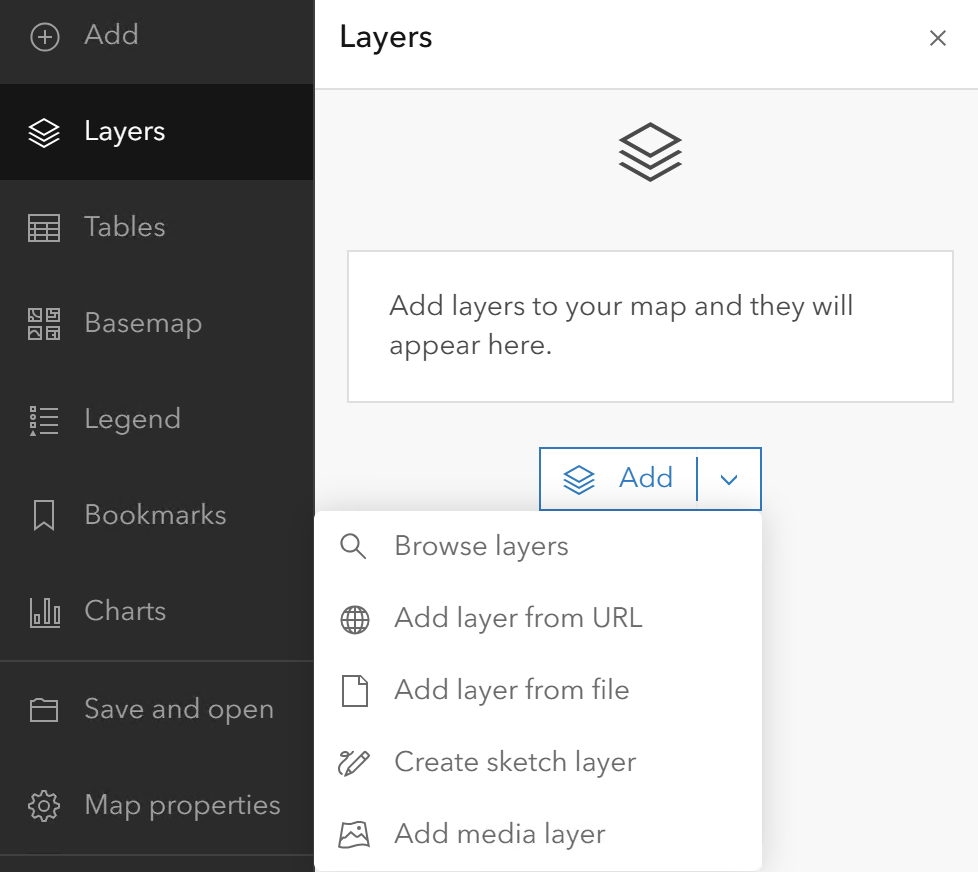
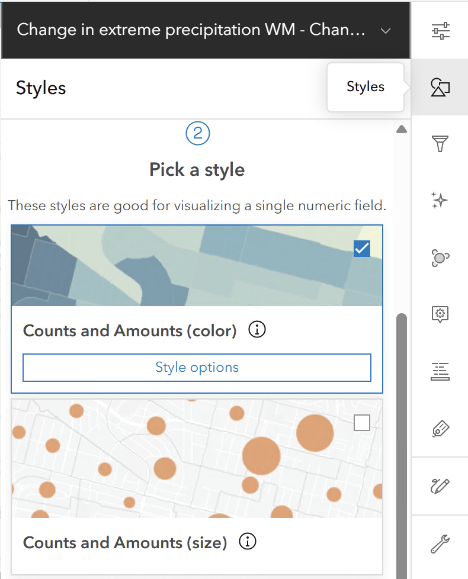
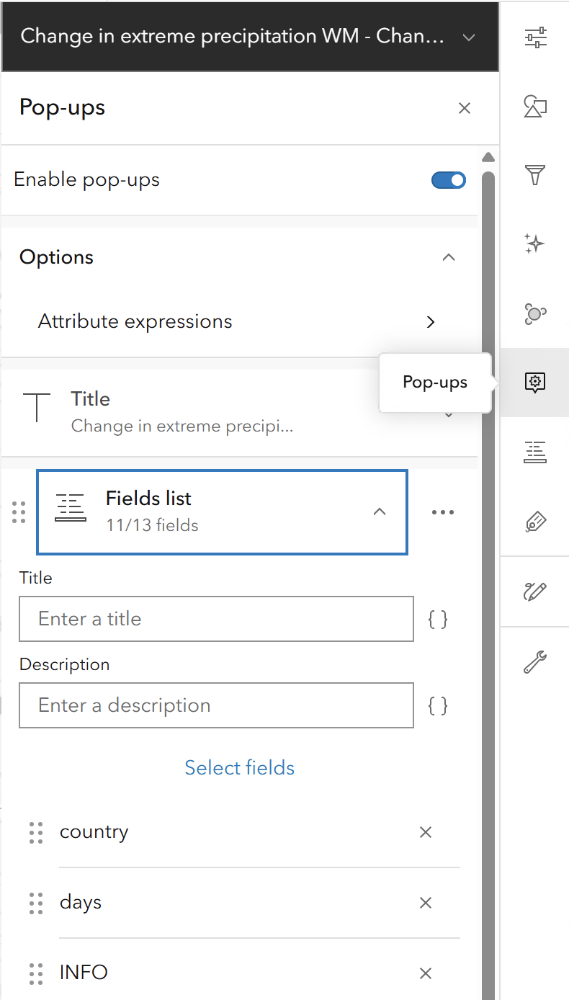
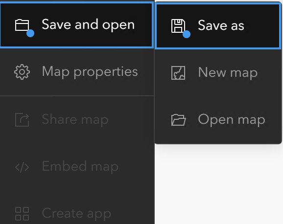

# Creating a Web Map on the EEA ArcGIS Portal

Creating a web map on the EEA ArcGIS Portal is one of the most effective ways to visualize environmental data and share insights across the agency. This guide will walk you through the process from start to finish.

## Introduction

### Objective
Learn how to create, configure, and share a web map on the EEA ArcGIS Portal.

### Prerequisites
- Access to the EEA ArcGIS Portal.
- Data services URLs (REST/WMS/WFS) ready to be added.

---

## Phase 1: Getting Started

### Log In and Open Map Viewer
1. **Log In**: Navigate to the EEA ArcGIS Portal and sign in with your EEA credentials.
   > If you have trouble logging in, check the [Portal Login guide](../../helpdesk/faq/portallogin.md).
2. **Open Map Viewer**: In the top navigation bar, click on `Map`. This opens the "Map Viewer" (the interface for map creation).

---

## Phase 2: Adding Data via URL

You can pull data directly from a server (like an ArcGIS Server or an OGC WMS/WFS service). This is the best practice for using "live" data.

### How to Add a Service URL
1. On the left-hand toolbar, click the `Add` button (+).
2. Select `Web Services` (or `Add Layer from URL`).
3. **Paste your URL**: This will usually look like a link ending in `/MapServer`, `/FeatureServer`, or `/ImageServer`.
   > **Note**: Choose REST for better compatibility and customizing options.
4. Click `Add to Map`.
{: style="height:300px;display: block; margin-left: auto; margin-right: auto; margin-top:20px; margin_bottom:20px"}

### Choosing the Right URL Level
When you append a layer ID (like `/0`) to the end of your URL, you change how the Portal interacts with the data.

- **Service URL** (e.g., `.../MapServer`): Adds all layers in the service. Good for maintaining default structure.
- **Layer URL** (e.g., `.../MapServer/0`): Adds a specific sub-layer.
  > **Pro Tip**: Only use the Layer URL (`/0`) if you specifically need to change the visual style or the popup configuration. If the default service looks exactly how you want it, stick with the Service URL for the best user experience.

---

## Phase 3: Configuring Symbology (Styles)

Once your layer appears, it will show the symbology and settings that were originally configured.

1. Select the layer in the `Layers` pane on the left.
2. On the right-hand vertical toolbar, click the `Styles` icon (circle, square, and triangle).
3. Click `+ Field` to choose which attribute you want to map (e.g., "Air Quality Index" or "Country Name").
4. The Portal will suggest a drawing style (e.g., "Counts and Amounts" for numbers or "Types" for categories).
5. Click **Style Options** to change colors, transparency, or symbol sizes.
{: style="height:300px;display: block; margin-left: auto; margin-right: auto; margin-top:20px; margin_bottom:20px"}

---

## Phase 4: Crafting Informative Pop-ups

A good web map doesn't just show dots; it provides context when a user clicks on a feature.

1. On the right-hand toolbar, click the `Pop-ups` icon.
2. **Enable Pop-ups**: Ensure the toggle is on.
3. **Title**: Use a field name in curly brackets, like `{Country_Name}`, to make the title dynamic.
4. **Fields List**: Click `Select fields` to hide technical jargon (like ObjectIDs) and only show the data that matters to your audience.
5. **Add Media**: You can even add charts or images that pull directly from the data attributes.
{: style="height:300px;display: block; margin-left: auto; margin-right: auto; margin-top:20px; margin_bottom:20px"}

---

## Phase 5: Saving and Sharing

Your map isn't done until it's saved and shared with your colleagues.

### Save
1. On the far-left toolbar, click the `Save and open` icon (the folder/disk).
2. Give your map a clear **title**, **tags** and a brief **summary**.

### Share
Click the `Share` button and modify permissions:
- **Owner**: Only you can see it.
- **Organization**: Everyone at the EEA can see it.
- **Public**: Send a request to Discomap team to share a product publicly.
{: style="height:300px;display: block; margin-left: auto; margin-right: auto; margin-top:20px; margin_bottom:20px"}

---

## Conclusion & Best Practices

### Key Tips for EEA Users
- **Basemaps**: Use the `Basemap` button on the left to switch between the different basemaps that are available on the Gallery.
- **Layer Order**: You can drag and drop layers in the list to change their drawing order. Always keep points on top, lines in the middle, and polygons (areas) at the bottom.
