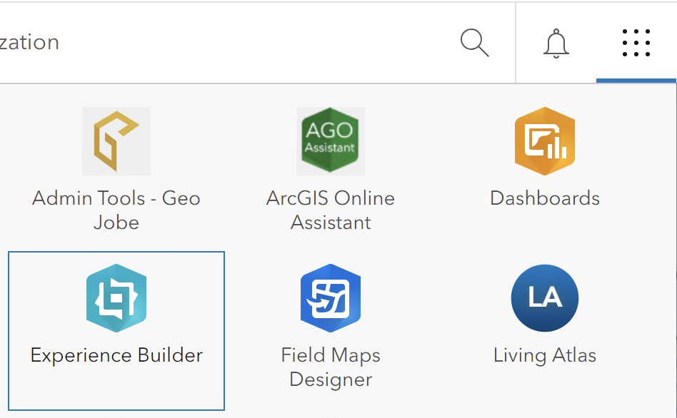

# Understanding the Available Environments

ArcGIS Experience Builder provides two main environments for creating applications: the integrated environment within ArcGIS Portal and a developer-focused environment hosted on the "Adventure" server. This guide will help you understand the differences and best practices for using each environment.

---

## Integrated Experience Builder in ArcGIS Portal

The primary and **official environment** for creating web applications in the ArcGIS ecosystem is the Experience Builder integrated within ArcGIS Portal.
{: style="height:300px;display: block; margin-left: auto; margin-right: auto; margin-top:20px; margin_bottom:20px"}

### Key Features
- **Standard Environment**: It is the default platform for building and sharing applications.
- **Ease of Use**: The interface is user-friendly and designed for a seamless experience in creating, configuring, and publishing applications.
- **Access to EEA Widgets**: The European Environment Agency (EEA) provides custom widgets that are available within this environment.

### When to Use
Always use the integrated Experience Builder in ArcGIS Portal unless there is a specific need for custom development. This environment ensures stability, support, and access to all available widgets provided by the EEA.

---

## Experience Builder for Developers

The **Adventure server** is available at [https://adventure.discomap.eea.europa.eu/](https://adventure.discomap.eea.europa.eu/) and is designed for developers and expert users who need specific customization capabilities.

### Key Features
- **Developer-Focused**: This environment is specifically oriented towards those with development expertise and a need for deeper customization.
- **Custom Themes and Widgets**: It allows the development of custom themes and widgets, extending the standard functionalities of Experience Builder.
- **Application Download & Deployment**: Developers can download the applications created in this environment and deploy them to a separate web server.

### When to Use
Use the Adventure server environment if:

- There is a need to develop highly customized themes or widgets not available in the integrated Experience Builder.
- You need to deploy your application to a web server outside of the standard ArcGIS infrastructure. 

> **Note**: Always default to the integrated environment in ArcGIS Portal unless there is a clear need for customization. Keep in mind that the Discomap team can also create alias URL for apps created within the integrated Experience Builder in ArcGIS Portal. Contact the Discomap team if a required widget or theme is missing from the standard environment.

---

## Best Practices and Recommendations

- **Default to the Integrated Environment**: For most users, the Experience Builder within ArcGIS Portal provides all necessary tools and widgets to create and publish applications.
- **Utilize EEA Widgets**: Take advantage of the custom widgets provided by the EEA within the integrated environment for enhanced functionalities.
- **Contact Support if Needed**: If any custom widget or theme is not available in the Portal environment, please reach out to the Discomap team for assistance.

By understanding the differences between these two environments, you can select the most appropriate tool for your application development needs.