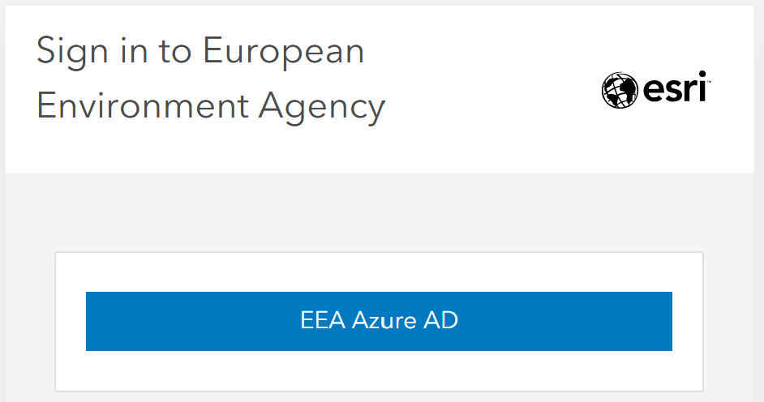

# How to Login to Discomap Portal

This guide is designed to help EEA users log in to the Discomap portal. It also contains some Frequently Asked Questions (FAQ) to assist you in case of issues or questions.

## Steps to Login

1. Go to the portal page: [Discomap Login Page](https://portal.discomap.eea.europa.eu/arcgis/home/signin.html).

   On the top right corner, locate the **Sign In** button.  
   Click the **Sign In** button, and you will see two options:

   - **EEA Azure AD**
   - **ArcGIS login**

    
2. Click on **EEA Azure AD**.  
   {: style="height:250px;display: block; margin-left: auto; margin-right: auto; margin-top:20px; margin_bottom:20px"}
    
3. You will be redirected to the standard EEA Microsoft login page.
   Enter your **EEA Email address** (e.g., `name.surname@eea.europa.eu`) or the e-mail address you use to access EEA services.
    
4. Follow the standard authentication procedures (password, authenticator app) as you would for other EEA services (e.g., Teams, Outlook).
    
5. After logging in, you will be redirected back to the Discomap Portal.
 
6. Verify your identity in the top-right corner. It should display your name/email.
 

---

## Frequently Asked Questions (FAQ)

### 1. I am trying to log in with my username and password, but it does not work. What could be wrong?

**Answer**: Ensure you are selecting **EEA Azure AD** instead of **ArcGIS login**. The ArcGIS login is reserved for specific non-EEA accounts or system administrators.
 

---

### 2. My login is stuck or looping.

**Answer**: Try clearing your browser cache or opening the portal in an Incognito/Private window. If the issue persists, contact the Discomap helpdesk.

---

### 3. Who do I contact for support?

- Discomap helpdesk: [discomap@eionet.europa.eu](mailto:discomap@eionet.europa.eu)